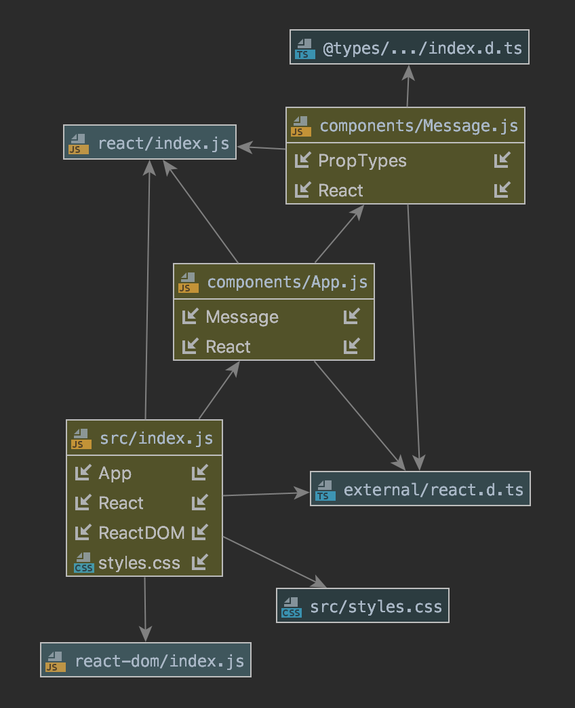

# LAB - 28

## Assignment 1 - Props Practice

### Author: Austin Hedeen

### Links and Resources
* [Submission PR](https://github.com/austinhedeen-401-advanced-javascript/lab-28a-props/pull/1)
* [Travis](https://travis-ci.com/austinhedeen-401-advanced-javascript/lab-28a-props)
* [Part 1](https://github.com/austinhedeen-401-advanced-javascript/lab-28a-props/pull/1/files/d2330dd518c6ebbb58379d7d3382e5929745265a..ae3bfd89d9ceeb775c7a220fd15dd216e1de0a43)
* [Part 2](https://github.com/austinhedeen-401-advanced-javascript/lab-28a-props/pull/1/commits/30a617d6ff5a6d46263db2400b4c7ed327b07112)

#### Running the app
* `npm start`
  
#### Tests
* `npm test`

#### UML

